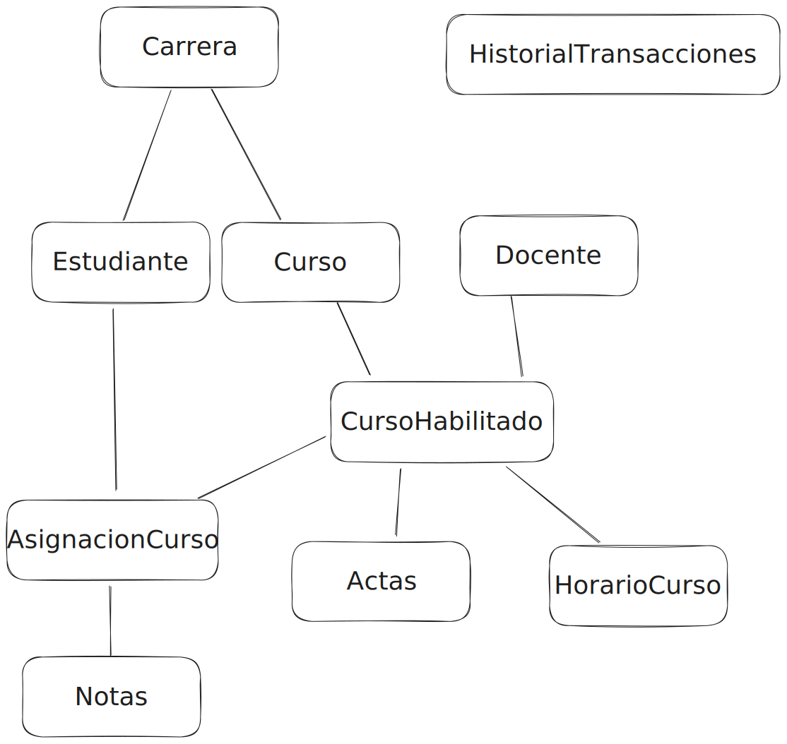
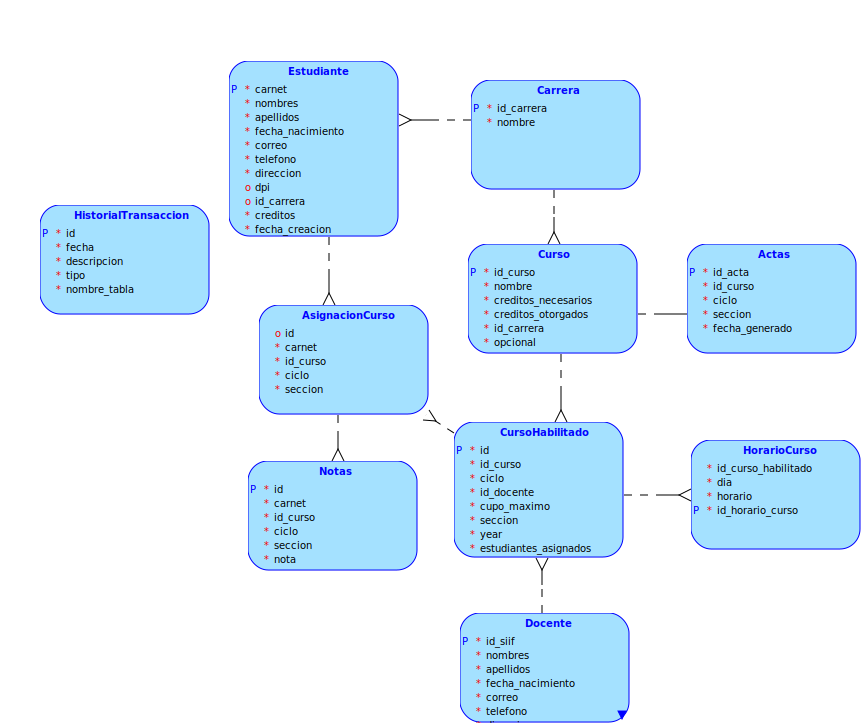
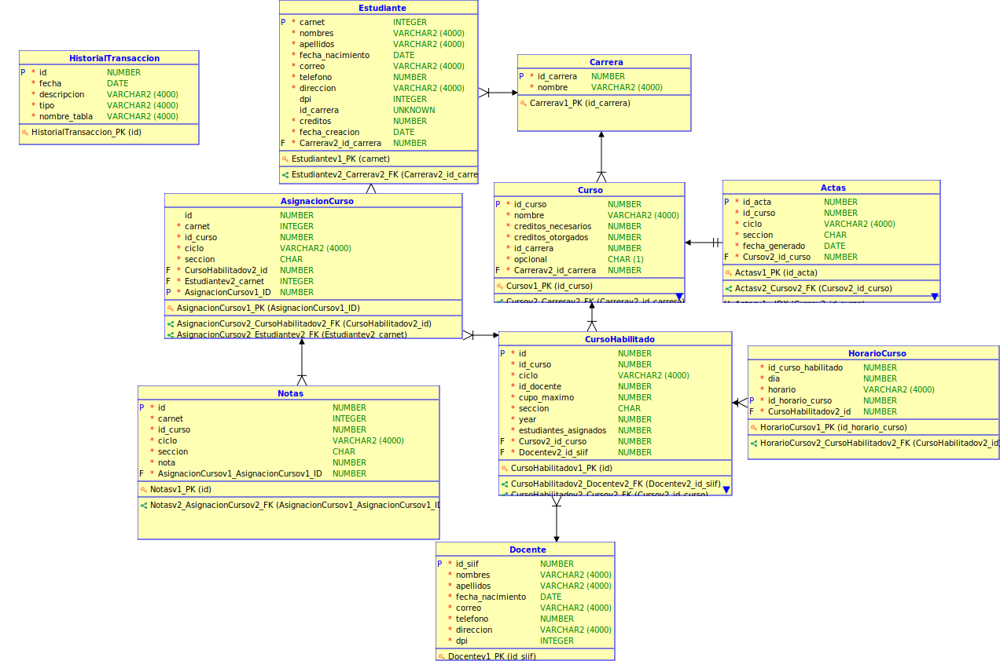

# Proyecto 2
# Universidad de San Carlos de Guatemala
# Facultad de Ingeniería
# Escuela de Ciencias y Sistemas
# Sistema de Bases de Datos 1

# Indice

- [Introducción](#introducción)
- [Modelo conceptual](#modelo-conceptual)
- [Modelo lógico](#modelo-lógico)
- [Modelo físico](#modelo-físico)

# Introducción

El proyecto consiste en la implementación de un sistema de gestión de base de datos, el cual se encargará de administrar la información de la Facultad de Ingeniería de la Universidad de San Carlos de Guatemala. El sistema de gestión de base de datos se encargará de almacenar la información de los estudiantes, profesores, cursos, pensum, etc. Además, el sistema de gestión de base de datos permitirá realizar consultas a la base de datos, las cuales serán de gran utilidad para la Facultad de Ingeniería.

# Modelo conceptual

# Modelo lógico

# Modelo físico

